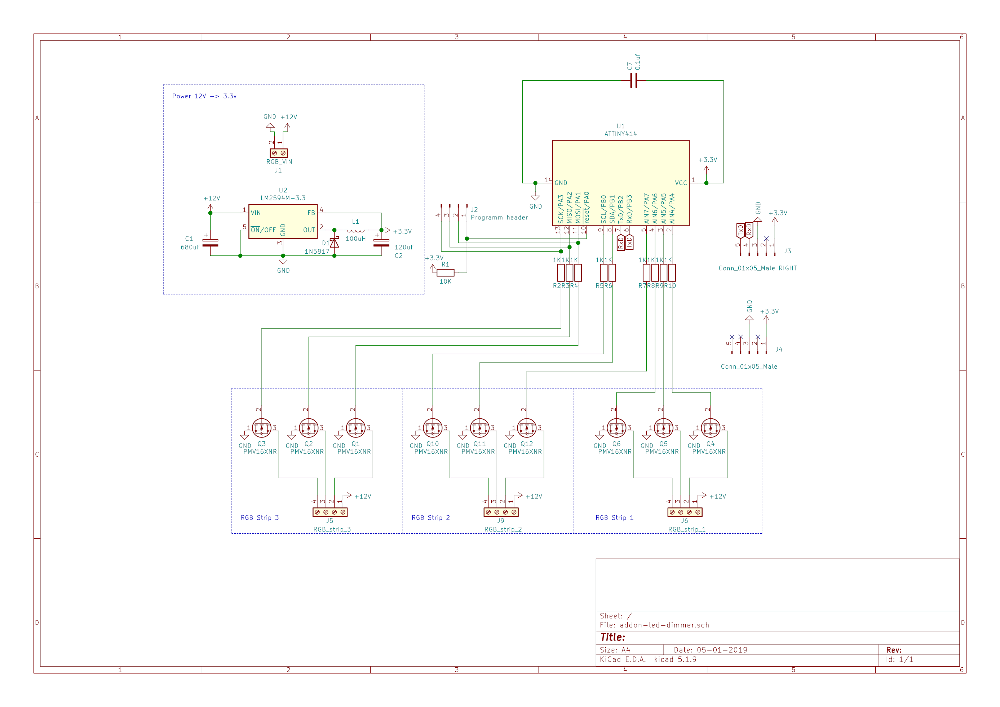
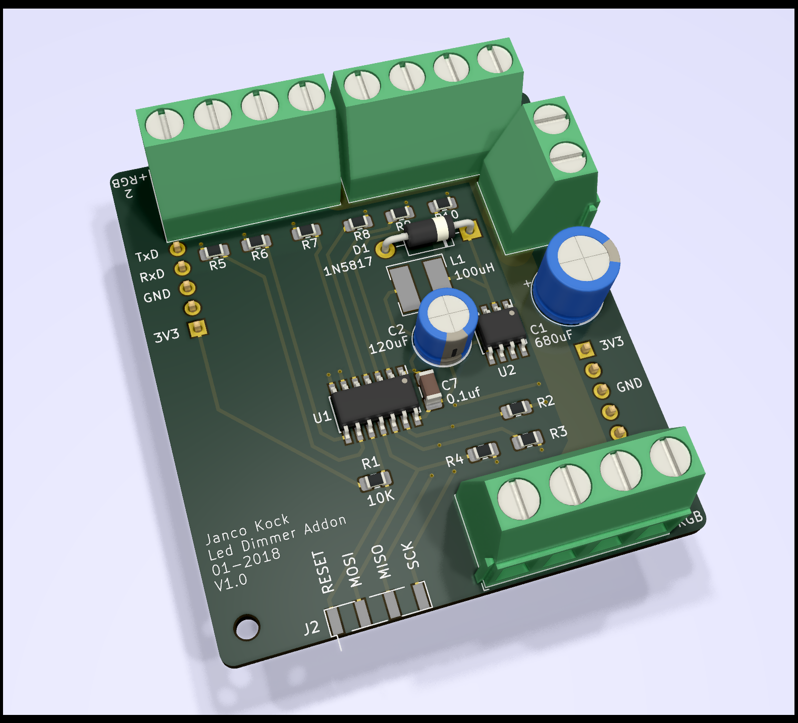
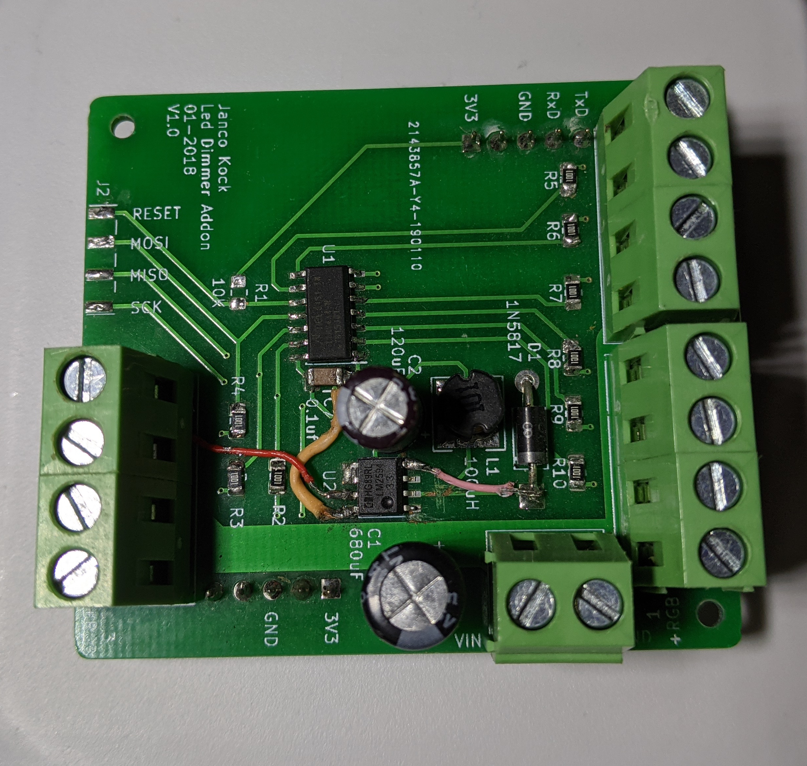

# 9 Channel PWM Dimmer Addon
This is a custom made PWM dimmer addon which fits on the back of the [Wireless sensor board](https://github.com/JDomotic/esp12-wireless-sensor-board) .

The board can receive commands over uart with configurable transition speed per channel

## Version 1 | 05-01-2019
**Features**:
* Onboard 500ma 3.3v power regulator to power itself and the wireless sensor board
* Support for 12v led strips 
* 9 PWM channels 8 bit

**Schematic**

**BOM**

**Ref**|**Qnty**|**Value**|**Footprint**|**Vendor (LCSC)**
:-----: | :-----: | :-----: | :-----: | :-----:
C1,|1|680uF|Capacitor\_THT:CP\_Radial\_D8.0mm\_P3.50mm|C59427|$0,0906
C2,|1|120uF|Capacitor\_THT:CP\_Radial\_D6.3mm\_P2.50mm|C251018|$0,1182
C7,|1|0.1uf|Capacitor\_SMD:C\_1206\_3216Metric\_Pad1.42x1.75mm\_HandSolder|C128353|$0,0179
D1,|1|1N5817|Diode\_THT:D\_DO-41\_SOD81\_P10.16mm\_Horizontal|C169165|$0,0223
J1,|1|RGB\_VIN|TerminalBlock\_Phoenix:TerminalBlock\_Phoenix\_MKDS-1,5-2\_1x02\_P5.00mm\_Horizontal|C8269|$0,0954
J3,|1|Conn\_01x05\_Male RIGHT|Connector\_PinHeader\_2.54mm:PinHeader\_1x05\_P2.54mm\_Vertical|-|0
J4,|1|Conn\_01x05\_Male|Connector\_PinHeader\_2.54mm:PinHeader\_1x05\_P2.54mm\_Vertical|-|0
J5,|2|RGB\_strip\_3|TerminalBlock\_Phoenix:TerminalBlock\_Phoenix\_MKDS-1,5-4\_1x04\_P5.00mm\_Horizontal|C8269|$0,1908
J6,|2|RGB\_strip\_1|TerminalBlock\_Phoenix:TerminalBlock\_Phoenix\_MKDS-1,5-4\_1x04\_P5.00mm\_Horizontal|C8269|$0,1908
J9,|2|RGB\_strip\_2|TerminalBlock\_Phoenix:TerminalBlock\_Phoenix\_MKDS-1,5-4\_1x04\_P5.00mm\_Horizontal|C8269|$0,1908
L1,|1|100uH|Inductor\_SMD:L\_6.3x6.3\_H3|C10122|$0,0731
Q1, Q2, Q3, Q4, Q5, Q6, Q10, Q11, Q12,|9|PMV16XNR|Package\_TO\_SOT\_SMD:SOT-23|C110920|$0,8064
R1,|1|10K|Resistor\_SMD:R\_0805\_2012Metric\_Pad1.15x1.40mm\_HandSolder|C103904|$0,0025
R2, R3, R4, R5, R6, R7, R8, R9, R10,|9|1K|Resistor\_SMD:R\_0805\_2012Metric\_Pad1.15x1.40mm\_HandSolder|C95781|$0,0360
U1,|1|ATTINY414|Package\_SO:SOIC-14\_3.9x8.7mm\_P1.27mm|C189365|$0,7137
U2,|1|LM2594M-3.3|Package\_SO:SOIC-8\_3.9x4.9mm\_P1.27mm|C316691|$0,6088

**Render**

**Assembled**

**Issues**

As vissible in the assembly, there are a few issues. 
1. The wrong SOT-23 footprint is used. Due this, the mosfets needs to be soldered upside down (This because pin 1 and 2 are flipped) 
2. The wrong pin layout for U2 is used. The trace to pad 1, 2 and 4 needs to be scratched. Pad 4 needs to be connected to D1, pad 8 to 3.3v and pad 7 to VIN. 

